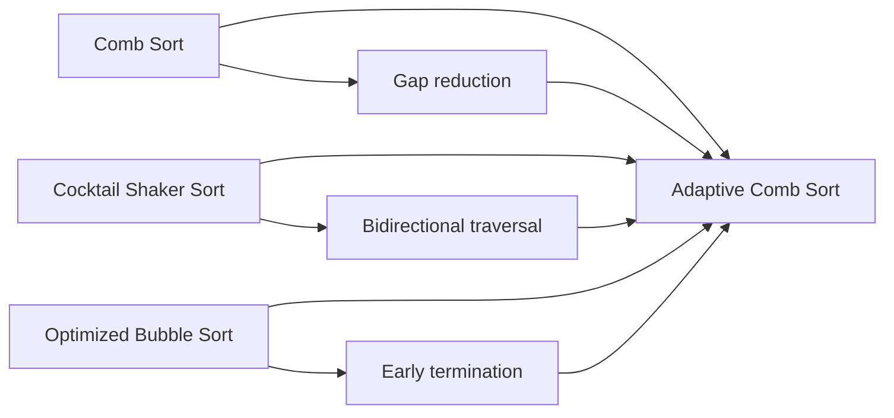
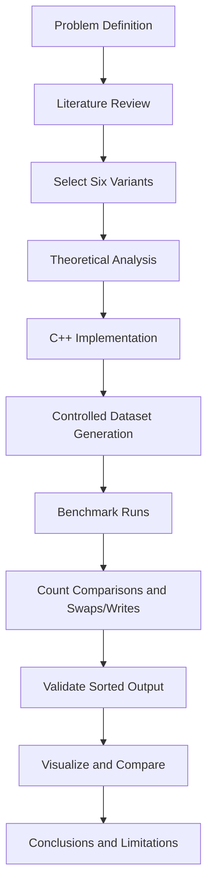

# Comparative Analysis of Bubble Sort Variants

An academic **Analysis of Algorithms** project by **Muhammad Mansoor Ur Rehman** and **Zia** investigating six Bubble Sort variants through theoretical analysis and controlled experiments.

> **Main contribution:** a proposed **Adaptive Comb Sort** hybrid combining Comb-style gap reduction, Cocktail Shaker-style bidirectional traversal, and early termination.


## Project Overview

Bubble Sort is easy to understand but inefficient for large inputs. This project studies how different modifications change its behavior when the input is already sorted, nearly sorted, reverse sorted, random, or duplicate-heavy.

We compare:

1. **Standard Bubble Sort**
2. **Optimized Bubble Sort** with early termination
3. **Cocktail Shaker Sort** with bidirectional passes
4. **Comb Sort** with shrinking comparison gaps
5. **Odd-Even Sort**
6. **Adaptive Comb Sort**, our proposed hybrid

The study focuses on **comparisons and swaps/writes** as primary operation-level metrics, with wall-clock timing included only as an optional machine-dependent measurement in the reconstructed runnable implementation.

## Team

**Muhammad Mansoor Ur Rehman**  
**Zia Ur Rehman**

Academic project for **Analysis of Algorithms**.

## Objectives

- Compare six related sorting algorithms.
- Examine how input order influences algorithmic work.
- Study the effect of early termination and long-distance comparisons.
- Design a hybrid sorting variant from established techniques.
- Evaluate the hybrid using controlled datasets and multiple input sizes.
- Connect theoretical complexity with empirical observations.

## Algorithms Compared

| Algorithm | Main idea | Best case | Average case | Worst case | Stable? |
|---|---|---:|---:|---:|:---:|
| Standard Bubble Sort | Adjacent comparisons over fixed passes | O(n²) | O(n²) | O(n²) | Yes |
| Optimized Bubble Sort | Stops after a pass with no swaps | O(n) | O(n²) | O(n²) | Yes |
| Cocktail Shaker Sort | Alternates forward/backward adjacent passes | O(n) | O(n²) | O(n²) | Yes |
| Comb Sort | Compares elements separated by a shrinking gap | implementation-dependent | typically better than Bubble in practice | O(n²) | No |
| Odd-Even Sort | Alternating odd/even compare-swap phases | O(n) with early exit | O(n²) | O(n²) | Yes |
| Adaptive Comb Sort | Gap reduction + bidirectional passes + early exit | input-dependent | empirically evaluated | O(n²) upper bound | No |

Complexity claims for Comb Sort can vary with shrink policy and analysis model. This project avoids presenting a single universal tight average-case bound.

## Adaptive Comb Sort

The proposed hybrid combines three established ideas:



The intended benefit is to move distant out-of-order elements quickly while still allowing the algorithm to react to favorable input structure.

This is presented as a **proposed academic hybrid**, not as a formally proven novel sorting algorithm.

## Methodology



### Input distributions

- **Sorted:** ascending order.
- **Nearly sorted:** mostly ordered with a small number of displaced elements.
- **Reverse sorted:** descending order.
- **Random:** pseudorandom values using a fixed seed in the reference runner.
- **Duplicate-heavy:** values drawn from a small range to create frequent equal elements.

### Input sizes

The documented study includes detailed small cases at **n = 8, 9, 10** and scalability cases at **n = 100, 1,000, 5,000, 10,000**.

## Reported Academic Results

These values are reproduced from the supplied academic project material.

### Nearly sorted, n = 10

| Algorithm | Comparisons | Swaps |
|---|---:|---:|
| Standard Bubble | 45 | 3 |
| Optimized Bubble | 25 | 3 |
| Cocktail Shaker | 23 | 3 |
| Comb | 18 | 2 |
| Odd-Even | 45 | 3 |
| **Adaptive Comb** | **16** | **2** |

### Reverse sorted, n = 10

| Algorithm | Comparisons | Swaps |
|---|---:|---:|
| Standard Bubble | 45 | 45 |
| Optimized Bubble | 45 | 45 |
| Cocktail Shaker | 45 | 45 |
| Comb | 30 | 22 |
| Odd-Even | 45 | 45 |
| **Adaptive Comb** | **26** | **20** |

These are the **reported results from the academic study**. They are kept separate from the newly reconstructed runnable implementation described below.

## Reconstructed Runnable Implementation

The original submission archive did not contain the original C++ source. To make this repository complete and reproducible, `src/main.cpp` contains a **reference implementation reconstructed from the documented algorithms and methodology**.

It implements all six algorithms, generates the five documented dataset types, records comparisons/swaps, records optional elapsed time, and verifies every output with `std::is_sorted`.

Because the original source was unavailable, the reconstructed implementation is **not claimed to reproduce the original source code or every reported operation count**. Its generated measurements are therefore supplementary experiments, not replacements for the academic report's reported results.

## Running the Project

### Requirements

- C++17 compiler such as `g++`
- GNU Make (optional)

### With Make

```bash
make run
```

This builds `src/main.cpp` and writes the generated benchmark to:

```text
results/benchmark_results.csv
```

### Without Make

```bash
g++ -std=c++17 -O2 -Wall -Wextra -pedantic src/main.cpp -o bubble_sort_analysis
./bubble_sort_analysis results/benchmark_results.csv
```

### Output columns

| Column | Meaning |
|---|---|
| `algorithm` | Sorting algorithm used |
| `dataset` | Input distribution |
| `n` | Input size |
| `comparisons` | Element-order comparisons |
| `swaps` | Data exchanges performed |
| `elapsed_us` | Measured wall-clock time in microseconds |
| `correct` | Whether the final array was sorted |

Wall-clock times are hardware/compiler dependent and should not be used as universal algorithmic constants.

## Repository Structure

```text
bubble-sort-variants-analysis/
├── .github/
│   └── workflows/
│       └── cpp-build.yml
├── README.md
├── LICENSE
├── Makefile
├── data/
│   └── operation_counts.csv
├── diagrams/
│   ├── adaptive-comb-sort.mermaid
│   ├── algorithm-family.mermaid
│   └── methodology.mermaid
├── docs/
│   ├── academic-report.md
│   ├── algorithm-comparison.md
│   ├── implementation-notes.md
│   ├── methodology.md
│   └── reproducibility.md
├── results/
│   ├── README.md
│   ├── generated_sorted.csv
│   ├── generated_nearly_sorted.csv
│   ├── generated_reverse.csv
│   ├── generated_random.csv
│   └── generated_duplicate_heavy.csv
└── src/
    ├── README.md
    └── main.cpp
```

## Key Findings

The original study demonstrates that algorithmic changes can substantially reduce work on particular input structures. Early termination is especially effective on favorable inputs, while gap-based comparisons help move distant elements.

The reconstructed reference implementation is intentionally documented as a separate experimental layer. It can be rerun, inspected, modified, and extended without conflating its measurements with the values reported in the original academic study.

## Limitations

- The academic study emphasizes operation counts rather than statistically rigorous wall-clock benchmarking.
- The original C++ submission source was unavailable, so the repository's implementation is a reconstruction based on the documented design.
- The proposed Adaptive Comb Sort has no formal proof of asymptotic superiority over established algorithms.
- Results depend on implementation details, gap policy, compiler settings, hardware, and dataset generation.

## Further Work

- Refactor the implementation into reusable headers and benchmark modules.
- Add repeated trials and statistical summaries.
- Compare multiple Comb shrink factors.
- Add formal invariant-based correctness tests.
- Investigate whether alternative adaptive policies can retain the reported small-input advantages without adding excessive comparisons.

## Academic Report

The cleaned and corrected public-facing academic write-up is available in [`docs/academic-report.md`](docs/academic-report.md).

## License

This repository is intended primarily for academic and educational use.
