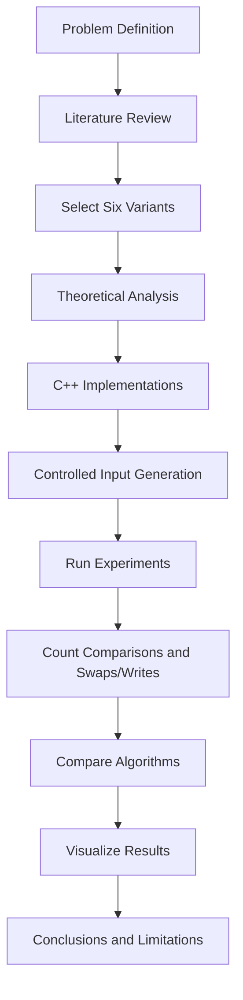

# Comparative Analysis of Bubble Sort Variants

An academic Analysis of Algorithms project investigating the behavior of six Bubble Sort variants through theoretical analysis and controlled operation-count experiments.

> **Main contribution:** a proposed **Adaptive Comb Sort** hybrid that combines gap reduction, bidirectional traversal, and early termination.

## Project Overview

Bubble Sort is simple and easy to understand, but its basic form performs poorly as input size grows. This project studies several variants that modify how comparisons are organized, how far elements can move in one step, and when unnecessary work can be stopped.

We implemented and compared:

1. **Standard Bubble Sort**
2. **Optimized Bubble Sort** with early termination
3. **Cocktail Shaker Sort** with bidirectional passes
4. **Comb Sort** with progressively reduced comparison gaps
5. **Odd-Even Sort**
6. **Adaptive Comb Sort**, our proposed hybrid variant

The algorithms were evaluated on multiple input distributions, including sorted, nearly sorted, reverse-sorted, random, and duplicate-heavy data.

## Team

**Muhammad Mansoor Ur Rehman**  
**Zia**

Academic project for **Analysis of Algorithms**.

## Objectives

- Compare the practical behavior of common Bubble Sort variants.
- Examine how input order affects comparisons and swaps/writes.
- Study the impact of adaptive optimizations.
- Design a hybrid variant that combines useful ideas from established algorithms.
- Evaluate the proposed variant using controlled experiments.
- Connect theoretical complexity analysis with empirical observations.

## Algorithms Compared

| Algorithm | Main idea | Best case | Average case | Worst case | Stable? |
|---|---|---:|---:|---:|:---:|
| Standard Bubble Sort | Adjacent comparisons over repeated passes | O(n²) | O(n²) | O(n²) | Yes |
| Optimized Bubble Sort | Stops when a full pass has no swaps | O(n) | O(n²) | O(n²) | Yes |
| Cocktail Shaker Sort | Bubble in both directions | O(n) | O(n²) | O(n²) | Yes |
| Comb Sort | Compare elements separated by a shrinking gap | O(n log n) reported in common analyses* | O(n²) | O(n²) | No |
| Odd-Even Sort | Alternate odd and even indexed compare-swap phases | O(n) with sortedness detection | O(n²) | O(n²) | Yes |
| Adaptive Comb Sort | Comb gaps + bidirectional passes + early termination | Experiment-dependent | Experiment-dependent | O(n²) upper bound | No |

\* Complexity notation for Comb Sort varies by shrink factor and analysis model. This project does not claim a universal tight bound beyond the standard worst-case upper bound.

### Important methodological note

The original study measured **operation counts** such as comparisons and swaps/writes. Those counts were used as the main basis for performance comparison. They should not be interpreted as precise CPU wall-clock timings.

## Adaptive Comb Sort

The proposed Adaptive Comb Sort combines three established ideas:

- **Gap reduction from Comb Sort:** allows distant out-of-order elements to move toward their correct region faster than adjacent-only comparisons.
- **Bidirectional traversal from Cocktail Shaker Sort:** allows movement in both directions during a cycle.
- **Early termination from Optimized Bubble Sort:** stops when a cycle makes no swaps.

The algorithm therefore attempts to gain the long-range movement of Comb Sort while retaining the adaptive behavior of early-exit and bidirectional passes.

This repository describes Adaptive Comb Sort as a **proposed academic hybrid**, not as a formally proven novel sorting algorithm.

## Methodology



## Experimental Design

The study considered input characteristics that commonly affect adaptive sorting algorithms:

- Already sorted
- Nearly sorted
- Reverse sorted
- Random
- Duplicate-heavy

Detailed operation-count examples were reported for **n = 8, 9, and 10**. The project also describes scalability experiments for **n = 100, 1,000, 5,000, and 10,000**. Only numerical results that were present in the supplied project material are reproduced here; missing large-scale measurements are not fabricated.

## Selected Results

For the reported **nearly sorted, n = 10** case:

| Algorithm | Comparisons | Swaps |
|---|---:|---:|
| Standard Bubble | 45 | 3 |
| Optimized Bubble | 25 | 3 |
| Cocktail Shaker | 23 | 3 |
| Comb | 18 | 2 |
| Odd-Even | 45 | 3 |
| **Adaptive Comb** | **16** | **2** |

For the reported **reverse sorted, n = 10** case:

| Algorithm | Comparisons | Swaps |
|---|---:|---:|
| Standard Bubble | 45 | 45 |
| Optimized Bubble | 45 | 45 |
| Cocktail Shaker | 45 | 45 |
| Comb | 30 | 22 |
| Odd-Even | 45 | 45 |
| **Adaptive Comb** | **26** | **20** |

These examples illustrate the intended finding: gap-based movement can reduce the amount of work needed to move distant elements, while adaptive termination can prevent unnecessary passes on favorable inputs.

## Project Structure

```text
bubble-sort-variants-analysis/
├── README.md
├── docs/
│   ├── academic-report.md
│   ├── algorithm-comparison.md
│   ├── methodology.md
│   └── reproducibility.md
├── diagrams/
│   ├── methodology.svg
│   ├── algorithm-family.svg
│   └── adaptive-comb-sort.svg
├── data/
│   └── operation_counts.csv
├── results/
│   ├── README.md
│   └── charts/
└── src/
    └── README.md
```

## Results and Interpretation

The study suggests several clear patterns:

- Basic Bubble Sort is highly sensitive to input size and does not adapt to sortedness unless an early-exit condition is added.
- Optimized Bubble Sort can become linear on already sorted data because it stops after detecting no swaps.
- Cocktail Shaker Sort can improve movement in both directions, especially when small elements and large elements are simultaneously far from their destinations.
- Comb Sort reduces long-distance disorder efficiently by comparing elements separated by a shrinking gap.
- Odd-Even Sort is structurally interesting and can support parallel formulations, but its sequential operation counts do not automatically make it superior to the other variants.
- Adaptive Comb Sort produced the lowest reported operation counts in several of the supplied small-input cases, motivating it as a promising hybrid for further investigation.

## Limitations

This project is an academic comparative study, not a production benchmarking suite. In particular:

1. The available report emphasizes operation counts rather than statistically rigorous CPU-time benchmarking.
2. Large-input numerical tables referenced in the report were not all included in the supplied project files.
3. The proposed Adaptive Comb Sort was evaluated empirically but does not have a formal proof that it dominates the other algorithms across all input distributions.
4. Performance can depend on implementation details, compiler settings, hardware, gap-shrink policy, and dataset generation.

## Reproducibility

The repository is organized so the source implementation, experiment scripts, raw outputs, and figures can be added without changing the documented methodology. See [`docs/reproducibility.md`](docs/reproducibility.md).

## Academic Context

This repository contains the cleaned and corrected public-facing version of our Analysis of Algorithms project. The academic report is included in [`docs/academic-report.md`](docs/academic-report.md).

## License

This repository is intended primarily for academic and educational use.
