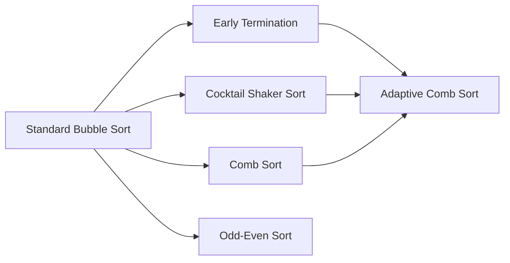

# Algorithm Comparison

## At a Glance

| Variant | Key Modification | Main Strength | Main Limitation |
|---|---|---|---|
| Standard Bubble Sort | Adjacent exchange | Simple baseline | Quadratic work even on sorted input in the baseline implementation |
| Optimized Bubble Sort | Early termination | Excellent on sorted/nearly sorted input | Still quadratic in the general case |
| Cocktail Shaker Sort | Forward + backward passes | Moves small and large misplaced elements in both directions | Still quadratic in general |
| Comb Sort | Shrinking gap | Moves distant elements faster | Not stable; still O(n²) worst case |
| Odd-Even Sort | Alternating odd/even phases | Parallelization-friendly structure | Sequential version remains quadratic |
| Adaptive Comb Sort | Gap + bidirectional + early exit | Combines complementary adaptive ideas | Hybrid behavior requires broader validation |

## Design Lineage

## Why These Variants Were Selected

The set provides a useful progression from the simplest adjacent-exchange baseline to variants that alter termination behavior, traversal direction, comparison distance, and execution structure.

## Interpretation

No single variant should be described as universally best. An appropriate conclusion is input-dependent:

- Sorted data strongly favors algorithms with early termination.
- Long-distance disorder favors gap-based movement.
- Bidirectional traversal can reduce some forms of asymmetry in element movement.
- Odd-Even Sort is particularly interesting when considering parallel execution.
- The proposed Adaptive Comb Sort is promising because it combines several complementary mechanisms.
