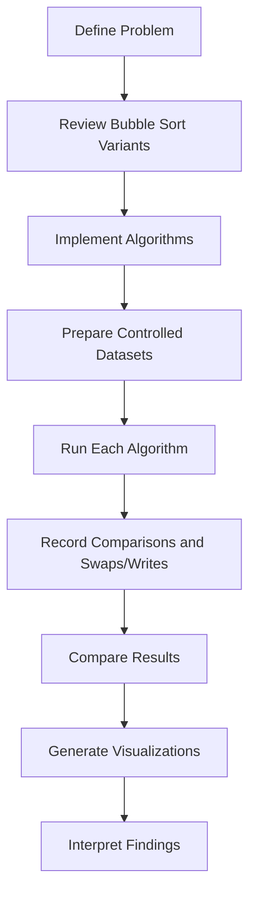

# Methodology

## Research Flow

## Independent Variables

The study varied two main dimensions:

### Algorithm

- Standard Bubble Sort
- Optimized Bubble Sort
- Cocktail Shaker Sort
- Comb Sort
- Odd-Even Sort
- Adaptive Comb Sort

### Input Distribution

- Sorted
- Nearly sorted
- Reverse sorted
- Random
- Duplicate-heavy

## Input Sizes

The detailed reported examples use small arrays (`n = 8, 9, 10`) to make operation counts easy to inspect manually. The project also describes larger runs at `n = 100, 1,000, 5,000, 10,000`.

## Dependent Measurements

The primary measured values are:

- Number of comparisons.
- Number of swaps/writes.

Lower counts indicate less algorithmic work under the measurement model used in the project.

## Why Operation Counts?

Counting comparisons and swaps/writes avoids some of the noise associated with wall-clock timing, including background processes and differences between machines. It also gives a direct view of the work performed by each algorithm.

This does **not** mean operation counts predict exact real-world runtime in every implementation. CPU caches, branch behavior, compiler optimization, memory access patterns, and other factors can alter elapsed time.

## Controlled Comparison

For a fair comparison, each algorithm should receive equivalent copies of the same input array within a test case. Repeated trials should use the same data distributions and, for generated random data, reproducible seeds.

## Interpretation Principle

The experiments are intended to answer:

> How does each algorithm's measured work change when input structure changes?

They are not intended to establish a universal ranking of sorting algorithms.
